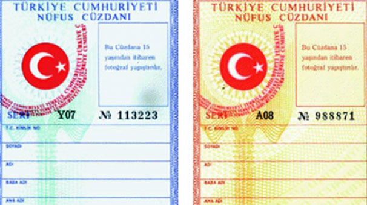
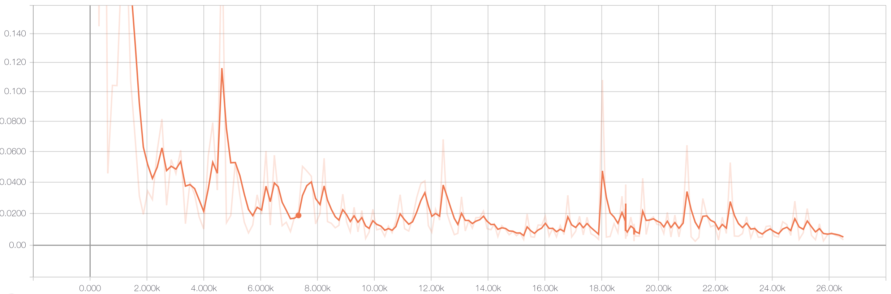

# Detecting the Turkey National Identification Cards


**What is R-CNN?** CNN (Convolutional Neural network) is a feedforward network, which mean the output of the neuron does not “loop back” to become the input of the previous time step. Hence, R-CNN is Recurrent Convolutional Neural Network, which mean the output of the neuron is loop back to become the input of the previous time steps.


| Old Turkey Identification Card  | New Turkey Identification Card   |
|---|---|
|   |   |


## Use Case

You can use this project to extract information DOB (name, surname, date of birth, etc.) on the identity card. To do this, I'm broke down the problem into sub-problems as below:

- [this project] Identify Regions of Interest (ROI) containing the required information with deep learning
- [this project] Crop the regions identified above
- OCR on the identified region of interest

This project can do object detection + object classification + multiple object detection all at the same time.

**Use case diagram**


## How to Run

tested on python 3x

**Requirements**

- tensorflow 
- numpy
- opencv

Runs the application with the default webcam.

```python
python3 id_card_detection_camera.py
```


Runs the application with the image file. Default image file "test_images/image1.jpg"

```python
python3 id_card_detection_image.py
```

## Result

Total  Loss Graphics



