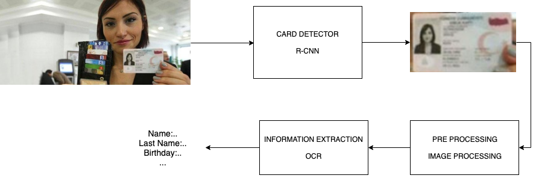
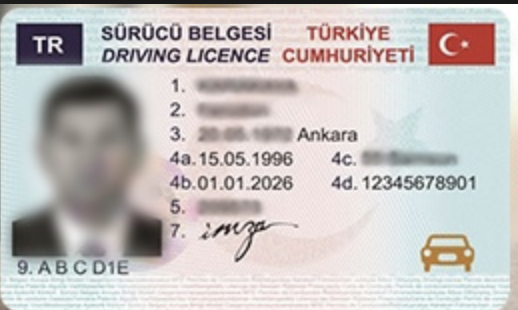
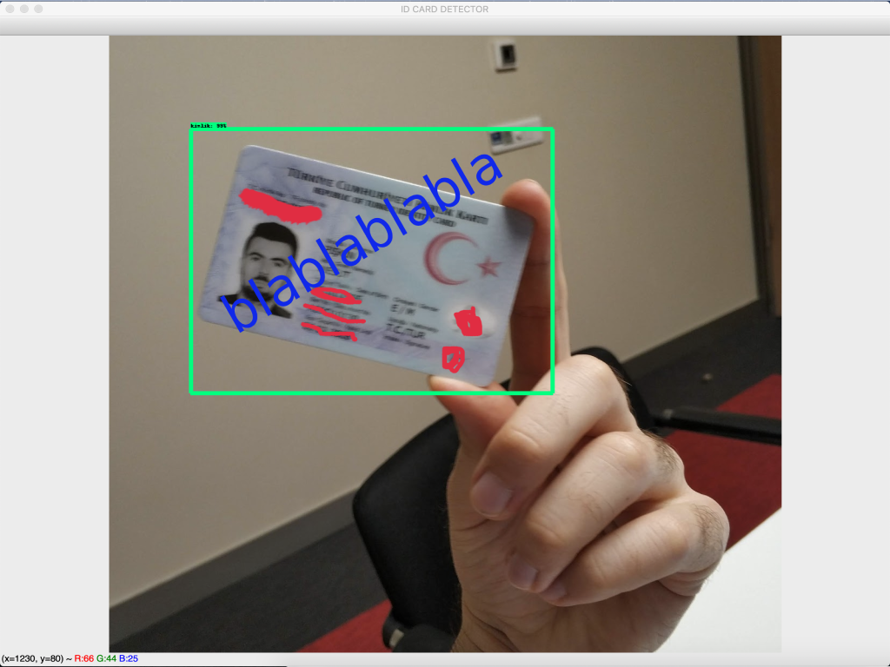

# Detecting the National Identification Cards


You can use this project to extract information DOB (name, surname, date of birth, etc.) on the identity card. To do this, I'm broke down the problem into sub-problems as below:

- [this project] Identify Regions of Interest (ROI) containing the required information with deep learning
- [this project] Crop the regions identified above
- OCR on the identified region of interest

This project can do object detection + object classification + multiple object detection all at the same time.

**Use case diagram**



Sample id cards

| Sample 1  | Sample 2 |Sample 3  |
|---|---|---|
|   |   |  |


## How to Run

tested on python 3x

**Requirements**

- tensorflow 
- numpy
- opencv

to install requirements

```bash
 pip3 install -r requirements.txt
 ```
 
Runs the application with the default webcam.

```python
python3 id_card_detection_camera.py
```


Runs the application with the image file. Default image file "test_images/image1.jpg"

```python
python3 id_card_detection_image.py
```

## Result


  

