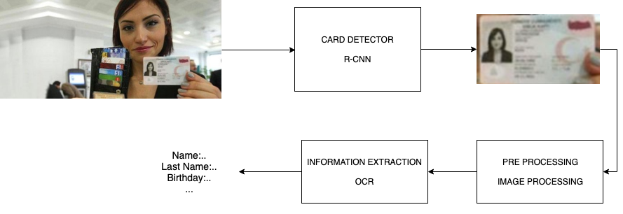
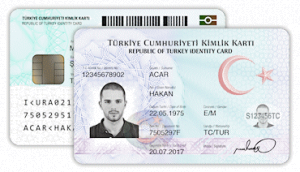
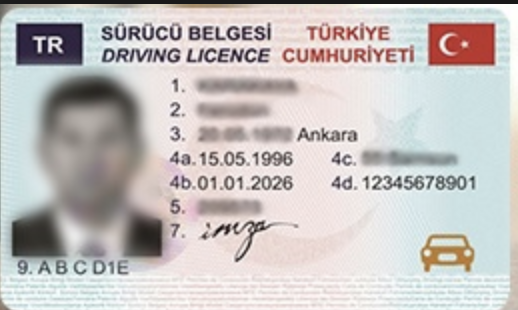
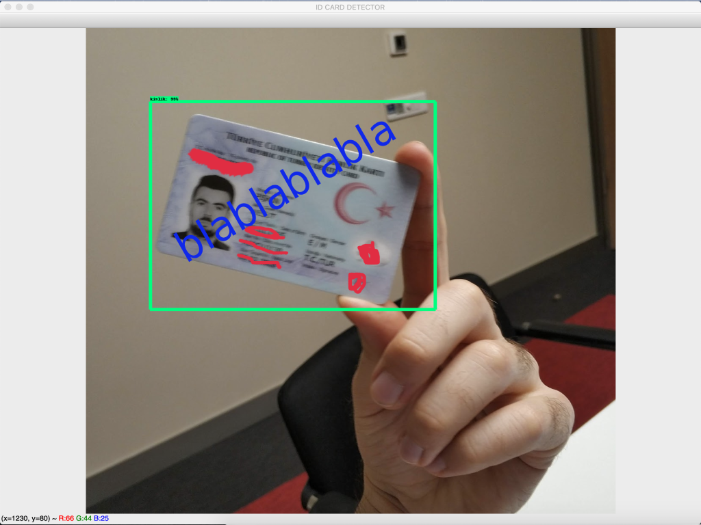

# Detecting the National Identification Cards

English | [Türkçe](README.tr.md)


You can use this project to extract information DOB (name, surname, date of birth, etc.) on the identity card. To do this, I'm broke down the problem into sub-problems as below:

- [this project] Identify Regions of Interest (ROI) containing the required information with deep learning
- [this project] Crop the regions identified above
- OCR on the identified region of interest

This project can do object detection + object classification + multiple object detection all at the same time.

**Use case diagram**



Sample id cards

| Sample 1  | Sample 2 |Sample 3  |
|---|---|---|
|   |   |  |


## Modernization Notes (2025)

This project has been refreshed after 7+ years. It now uses TensorFlow 2 (SavedModel) with optional OCR (EasyOCR).

- Removed TensorFlow 1 graph code and TF Object Detection API dependency. No more `object_detection.*` imports.
- Loads TF2 SavedModel from `model/saved_model/`; automatically resolves and calls the `serving_default` signature.
- `id_card_detection_image.py` CLI flags:
  - `--image`: Image path (absolute/relative)
  - `--min_score`: Score threshold (0–1, default 0.60)
  - `--ocr`: Run OCR (EasyOCR) on the cropped ROI
- Lightweight label map parser added; reads ID→name mapping from `data/labelmap.pbtxt`.
- Visualization via OpenCV; top-scoring box in green, others red. Cropped ROI is saved as `output_cropped.png`.

> Note: SavedModel output keys can vary between models. Defaults expect `detection_boxes`, `detection_scores`, `detection_classes`. Adjust easily if different.

## Setup and Run (Recommended TF2 + OCR)

Install either a single platform-specific requirements file (includes TensorFlow), or install TensorFlow separately plus `requirements-modern.txt`. YOLO is optional and can be installed with `ultralytics`.

### Option A) One-shot install (recommended)

- Apple Silicon (macOS):
```bash
pip3 install -r requirements-macos-apple.txt
```

- Intel macOS / Linux / Windows (CPU):
```bash
pip3 install -r requirements-cpu.txt
```

### Option B) Split install (advanced)

Install TensorFlow first, then the rest from `requirements-modern.txt`.

### 1) Install TensorFlow

- macOS (Apple Silicon, M-series):
```bash
pip3 install tensorflow-macos==2.16.1 tensorflow-metal==1.2.0
```

- macOS (Intel) or Linux (CPU):
```bash
pip3 install tensorflow==2.20.0
```

- Windows (CPU):
```bash
pip3 install tensorflow==2.17.1
```

> Tip: On Python 3.12, keep pip up to date: `python3 -m pip install --upgrade pip`

### 2) Other dependencies
```bash
pip3 install -r requirements-modern.txt
```

### 3) Run
```bash
python3 id_card_detection_image.py --image /absolute/or/relative/path.jpg --ocr --min_score 0.6
```

- Windows example path: `C:\\path\\to\\image.jpg`
- Cropped ROI is written as `output_cropped.png` at project root.
- With `--ocr`, extracted text lines are printed to the terminal.

### YOLO integration (optional)

Install YOLO backend:
```bash
pip3 install ultralytics
```

Run with YOLO instead of TF2 (image):
```bash
python3 id_card_detection_image.py --image /path/to/img.jpg --yolo_model yolov8n.pt --min_score 0.4 --ocr
```

Run with YOLO (camera) and enable OCR snapshot panel (keys 1–9 to OCR selected crop):
```bash
python3 id_card_detection_camera.py --yolo_model yolov8n.pt --min_score 0.4 --ocr
```

Camera window controls: q quit, p pause/resume, s stop camera, b start camera, 1–9 OCR selected snapshot.

## Command-line Arguments

Image script (`id_card_detection_image.py`):

- `--image` (string): Absolute or relative path to the image file. If omitted, defaults to `test_images/image1.png`.
- `--min_score` (float, default 0.60): Minimum confidence score threshold in [0,1] to visualize and crop detections. Lower it (e.g., 0.3–0.5) to see more candidates.
- `--ocr` (flag): If provided, runs EasyOCR on the cropped ROI and prints extracted text lines to the terminal.
- `--yolo_model` (string, optional): If provided, switches detector backend to YOLO. Accepts a local `.pt` path or a model name like `yolov8n.pt`. If omitted, TF2 SavedModel in `model/saved_model/` is used.

Camera script (`id_card_detection_camera.py`):

- `--camera` (int, default 0): Video device index. Try 1 or 2 if you have multiple cameras.
- `--min_score` (float, default 0.50): Minimum confidence score threshold for drawing detections and listing snapshots.
- `--yolo_model` (string, optional): YOLO model path/name, same behavior as in the image script.
- `--ocr` (flag): Enables the OCR workflow on detected snapshots. When enabled:
  - The right panel shows up to 9 cropped detections sorted by score.
  - Press number keys 1–9 to run OCR on the corresponding crop; results are shown under “OCR Result” in the right panel and printed to terminal.

Window hotkeys (camera):

- `q`: Quit.
- `p`: Pause/Resume the live feed (freezes on the last frame when paused).
- `s`: Stop (release) the camera device.
- `b`: Start/restart the camera device.
- `1–9`: Run OCR on the Nth snapshot in the right panel (only if `--ocr` was provided).

Outputs:

- Image script: draws boxes on the image window and saves the best ROI as `output_cropped.png` (project root). OCR text lines print to terminal.
- Camera script: draws boxes over the live feed; right panel lists thumbnails and shows OCR results if `--ocr` is enabled.

## Alternative: Legacy TF1 Flow

Requires Python 3.7 and TensorFlow 1.15. Hard to set up on modern systems.

```bash
pip3 install -r requirements.txt
python3 id_card_detection_image.py
```

> Warning: TF1 deps (esp. on macOS/ARM) are incompatible with modern Python. Prefer Docker or a dedicated Python 3.7 env if needed.

## Platform Notes

- macOS Apple Silicon: `tensorflow-macos` + `tensorflow-metal` required. First run may build font caches.
- macOS Intel / Linux: CPU `tensorflow` is sufficient; GPU not required.
- Windows: `pip install tensorflow==2.17.1` (CPU). Ensure Visual C++ Redistributable is installed if needed.

## Examples

- Recommended flow (macOS Apple Silicon):
```bash
pip3 install tensorflow-macos==2.16.1 tensorflow-metal==1.2.0
pip3 install -r requirements-modern.txt
python3 id_card_detection_image.py --image /Users/you/Downloads/test_data.jpg --ocr --min_score 0.6
```

- Recommended flow (Linux / macOS Intel):
```bash
pip3 install tensorflow==2.20.0
pip3 install -r requirements-modern.txt
python3 id_card_detection_image.py --image ./test_images/image1.png --min_score 0.6
```

## Result


  

